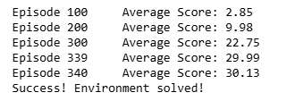
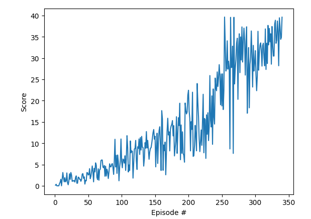

# Project Report

## Deep Deterministic Policy Gradient (DDPG) Overview

Reinforcement Learning (RL) methods can be categorized into **value-based** and **policy-based** approaches:  
- **Value-based methods** estimate the expected sum of rewards obtained by taking an action in a given state. In deep reinforcement learning, an agent selects the action with the highest **Q-value** (expected cumulative reward).  
- **Policy-based methods** directly predict the best action to take given a state, using a neural network.  

**Deep Deterministic Policy Gradient (DDPG)** is a powerful RL algorithm that combines both approaches. It consists of:  
- **Actor Network (Policy-Based):** Predicts the best action given the current state.  
- **Critic Network (Value-Based):** Evaluates the predicted action to determine its quality.  

By integrating these networks, DDPG enables effective learning in **continuous action spaces**.  

### Off-Policy Learning  

DDPG is an **off-policy** algorithm, meaning the learned policy differs from the one used during training. This allows for more efficient experience reuse.  

### Learning Process  

At each step, the agent:  
1. **Stores** the `(state, action, reward, next_state)` tuple in the **experience buffer**.  
2. **Samples** a batch from the buffer (once it contains enough experiences).  
3. **Learns** by updating its networks:  
   - The **Actor Network** takes the current state as input and outputs an action.  
   - The **Critic Network** takes the state and action as input and estimates the expected reward.  

To stabilize training, both networks have **target networks** (copies of the original networks), which are **soft-updated** at each step to prevent instability.  

### Training the Networks  

### **Critic Network Update**  
The Critic's error is measured as the difference between:  
- The **Q-value** outputted by the local Critic network.  
- The **Bellman equation** applied to the target network's Q-value:  

$$
Q_{\text{target}} = r + (\gamma \cdot Q_{\text{target, next}} \cdot (1 - \text{done}))
$$

- **$Q_{\text{target}}$** → The **target Q-value**, representing the estimated total reward for a given state-action pair.  
- **$r$** → The **immediate reward** received after taking an action.  
- **$\gamma$** (gamma) → The **discount factor** ($0 < \gamma \leq 1$), which determines how much future rewards influence the current value.  
- **$Q_{\text{target, next}}$** → The **Q-value of the next state**, estimated by the **target Critic network**.  
- **$\text{done}$** → A **binary indicator** (0 or 1) for whether the episode has ended:  
  - **done = 1** → The episode is over (future rewards are ignored).  
  - **done = 0** → The episode is ongoing (future rewards are considered).  
- **$(1 - \text{done})$** → Ensures that if the episode has ended, the **next state's Q-value is ignored** (since there are no future actions).  

This ensures that the local Critic network learns to estimate future expected returns correctly.  

### **Actor Network Update**  
The Actor’s error is measured by:  
1. Passing the predicted action (from the local Actor network) to the local Critic.  
2. Evaluating whether the Critic assigns a high **Q-value** to the action.  

By optimizing the Actor network to maximize the Critic’s evaluation, the agent learns to take better actions over time.  

### Improvements to the Neural Networks

Despite its efficiency, the simple neural network model is prone to instability. To address this, several improvements have been introduced in the DDPG:

#### 1. Target Neural Network
In the simple network, updating both the neural network weights and the output values simultaneously leads to instability. A **target network** is used to solve this problem:

- The target network has the same architecture as the main network but with weights "frozen" for a few episodes.
- The main network updates its weights based on the outputs provided by the target network.
- Periodically, the weights of the target network are synchronized with those of the main network, improving stability.
- The Actor has a local and a target network and the Critic also has a local and a taget network.

#### 2. Experience Replay Buffer
To prevent the network from overfitting to sequential patterns in the data, transitions `(s, a, r, s')` are stored in an **experience buffer**:

- Transitions are stored in the buffer.
- During training, random samples from the buffer are used, promoting diversity in the training data and improving efficiency.

#### 3. Ornstein–Uhlenbeck process
Ornstein-Uhlenbeck (OU) noise is added to the network's output to serve as an exploration term. This type of noise is well-suited for continuous action spaces because it is time-correlated, meaning that consecutive actions remain similar rather than changing abruptly. As a result, the model is less likely to propose actions that differ drastically from previous ones, leading to smoother exploration.

## Hyperparameters and Networks Architecture
The table below summarizes the hyperparamters of the DDPG agent that solved the environment.

| Parameter               | Experiment 1    |
|-------------------------|-----------|
| BUFFER_SIZE            | 100,00   | 
| BATCH_SIZE             | 128        | 
| GAMMA                  | 0.99      | 
| TAU                    | 1.00E-03  | 
| Actor Learning Rate     | 1.00E-04  | 
| Critic Learning Rate          |1.00E-04  |       
| n_hidden_layers        | 2         | 
| fc1_units              | 128       | 
| fc2_units              | 64       | 

### Actor and Critic Architectures  

The **Actor network** was structured as follows:  
33 (state size) → 128 → 64 → 4 (action size)

The **Critic network** followed a similar design:  
33 → 128 → 64 → 1

This was the **only combination of hyperparameters** that successfully solved the environment.  

### Hyperparameter Experiments and Observations  

#### 1️⃣ Batch Size  
- Adjusting `batch_size` had **little impact** on performance.  

#### 2️⃣ Smaller Networks  
- Networks with **fewer neurons** (e.g., `64 × 32`) in the hidden layers **failed to solve** the environment.  

#### 3️⃣ Higher Learning Rates  
- Increasing the learning rate for the **Actor** and **Critic** (e.g., `1.00E-03` or `5.00E-03`) **also failed** to solve the environment.  

#### 4️⃣ Noise Reduction Strategy  
- Implemented a **decaying noise process** to encourage **exploration early** in training while shifting towards **exploitation later**.  
- This approach **improved performance** but was **not sufficient** to solve the environment.  

#### 5️⃣ The Key Breakthrough  
✅ The **critical change** that enabled successful training was **reducing the learning rate** to **1.00E-04**.  
✅ With a **slower learning rate**, the algorithm was able to **converge and solve the environment in 340 episodes**.  

### Conclusion  
Through extensive experimentation, we found that **a well-balanced network architecture and a carefully tuned learning rate** were essential for solving the environment. This was a very simple analysis of the hyperparameters, providing only a preliminary understanding of their behavior. A more detailed investigation, involving extensive exploration of various hyperparameters, repeated experiments, collection of averages, and hypothesis testing, would be necessary to obtain clearer insights into the impact of hyperparameter tuning.

### Reward Plots During Training Across Four Experiments

The environment was successfully solved after 340 episodes, as shown in the figure below:

The following reward plot illustrates the performance improvements across episodes. This plot highlights how the agent's performance evolved during training.

## Ideas for Future Work
For future improvements, beyond a more in-depth study of hyperparameters, we suggest exploring more stable methodologies such as:  
- **Trust Region Policy Optimization (TRPO)**  
- **Truncated Natural Policy Gradient (TNPG)**  
- **Distributed Distributional Deep Deterministic Policy Gradient (D4PG)** (a state-of-the-art approach)  

Additionally, an interesting direction for future work would be comparing the results obtained in this single-agent scenario with the multi-agent Reacher environment to evaluate performance differences.  

